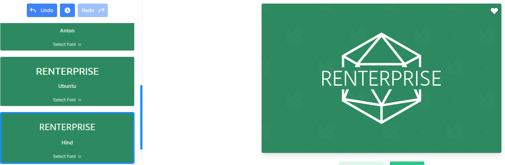
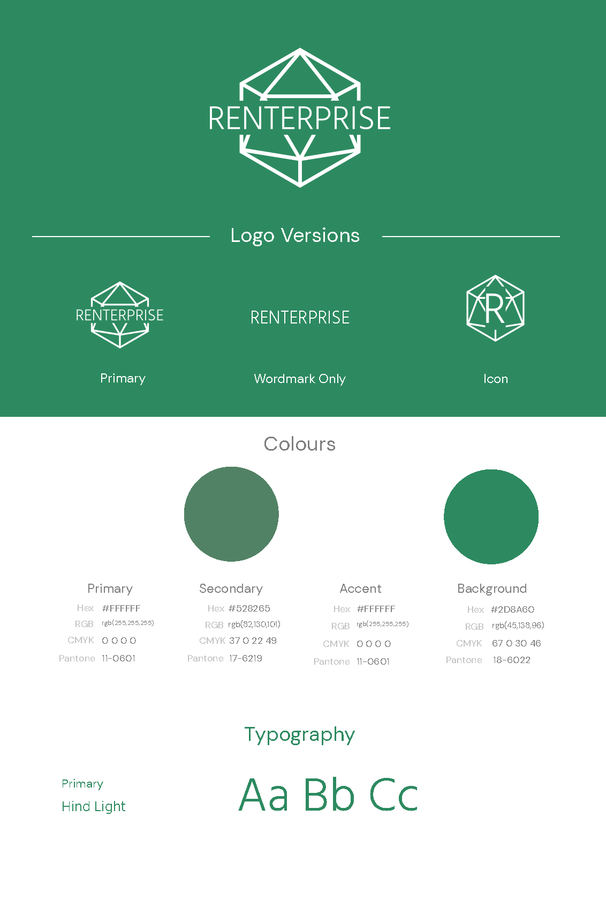

# Renterprise - The Program

***Click this banner to load the website.***

A secondary prototype for a rental booking system. To create orders for customers and provide them with hired equipment. This example is based on a company hiring mobility equipment. However, the stock is based on what your provide to it. Flexibility is key to this software.

More people are turning to rentals as the world finances are in disarray and they can have your product at a much more manageable  cost. 

This interface is developed using designs and features from [Portfolio 1](https://github.com/jbillcliffe/portfolio1-renterprise/ "Go to Portfolio 1 - Renterprise Website")[^4] and [Portfolio 3](https://github.com/jbillcliffe/portfolio3-booking-system/ "Go to Portfolio 3 - Renterprise Python Console Booking System")[^5].

**This software will improve your hire bookings right from the start!**

# User Experience Design

## Target Audience
- Current business owners ready to make a change to their software.
- A consumer who is ready to take on a new challenge.

## User Stories
- User stories and model structures created in GitHub Projects[^6]

## Wireframe Program Flow
Program flow wireframe was created using Figma[^1]. The image shows the processes through the stages of the software.
Some parts are still in development. New data structure implemented compared to Portfolio 3[^5].

## Logo - Redocumented from Portfolio 1.
The logo was created using the website LOGO.com[^2]. It has been pulled from my previous Renterprise project for Portfolio 1[^4].

### Logo Process - Redocumented from Portfolio 1[^4].
Using their step by step builder a full brand could be created from scratch, firstly the selection of software industry was chosen as it was accurate and appropriate.

Next, it gave an overall palette choice, blues, greens etc. Given the fact that a product is trying to be sold, and green symbolises wealth it seemed like a logical decision.

The creator then asked for a styling of the font to be used, a modern font was the best choice as it is for a modern product.

The final font choice for the logo was then made and it displayed the generated logo with it.

This was then the branding provided.

## Responsive

Attempts were made to use a responsive tester from previous projects. However, due to every page requiring security clearance the page would not load.

## Breakdown of Design - Redocumented from Portfolio 1[^4].

### Colour Theme
Colour theme was initially chosen and subsequently revised with Coolors.[^3] 
The overall palette was picked with the website tools which enabled complementary and contrasting colour choices based upon the initial colour from the logo.

# Features

## Existing Features

**Create Item**

Creating an item can be divided into two categories. The Item Type (stock option) and an Item (the owned stock option with a serial number)

***Add New Item Type***

A [form](readme/features/create-item/item-type/item-type-form.png "The Item Type form") that asks for little data, this is useful to allow quick adding of item types and with as few margins for error as possible. This security is further enhanced by form validation. A category to assign it to (categories used previously will mean that it can be joined together later on). [Validation](readme/features/create-item/item-type/validation-example.png "Form validation on item type creation") occurs on all the visible fields. It also uses Cloudinary[^7] to allow images to be stored externally and accessed remotely. These images are useful to provide continuity across items. Also featuring in this is django-crispy-forms[^102]. When complete a [success message](readme/features/create-item/item-type/success-prompt.png "Success prompt sent to user") is sent to the user.

***Add New Item***

A [form](readme/features/create-item/item/item-form.png "The Item form") that asks for very little data, this is useful to allow quick adding of it ems to stock and with as few margins for error as possible. This security is further enhanced by form validation. A category to assign it to (categories used previously will mean that it can be joined together later on). [Validation](readme/features/create-item/item/validation-example.png "Form validation on item creation") occurs on all the visible fields. When complete a [success message](readme/features/create-item/item/success-prompt.png "Success prompt sent to user") is sent to the user.

---

**Create Customer**

An easy to understand [form](readme/features/create-customer/customer-form.png "Overall view of the customer create form") which contains [floating labels](readme/features/create-customer/floating-labels.png "Showing floating labels inside textfields") to increase space available. It also features multiple points of [validation](readme/features/create-customer/validation-example.png "Form validation on customer creation") to ensure that there is a minimum amount of data required to create a customer.
Also features a drop down menu of [counties across the UK](readme/features/create-customer/localflavor.png "A sample of django-localflavor data in the dropdown"). Provided by django-localflavor[^101] python/django library. When complete a success message is sent to the user.

---

**Create Order**

More data is required for this [form](readme/features/create-order/order-form.png "Initial view of the order create form")/[complete form](readme/features/create-order/order-form-complete.png "Overall view of the order create form"). Requires a user to enter a delivery and collection [dates](readme/features/create-order/date-picker.png "View of the datepicker in use") will only validate if collection is after delivery, historical orders (dates before today) can be entered with no consequences.  
Orders are created in steps. First it asks for dates, secondly an item category then [item type](readme/features/create-order/item-to-order.png "View of the item selection in use")
The program searches the database for orders already on the system that match the item chosen, it will then filter any items out that are already booked in this date range. After filtering it will [display the items](readme/features/create-order/order-form-item-selection.png "Selecting the item to order") that can be chosen from the list of stock available. Once the item has been chosen, the submit button appears and it gets booked for those days and it will be unavailable to others in this date range. It does this and creates an initial invoice record (unpaid) into the system, once saved the user is [moved to another view](readme/features/create-order/order-view-page.png "Displaying the created order to the user."), which displays the order just created and gives a prompt to show it has been created. Finally, when the order is created it adds the amount paid onto the tally for the item. So it can be determined how much money an item has earned in rental payments.

---

**Creating Customer/Order Notes**

These two entries are discussed together as they perform the same function. But save into different places. Customer notes are designed to log communications with the customer across all of their orders. Order notes are entered within an order itself and are relevant only to the order.  
If no notes are available, a prompt is shown to the user : ([ Empty customer notes ](readme/features/create-notes/empty-customer-notes.png "Displaying empty customer notes prompt")/[ Empty order notes ](readme/features/create-notes/empty-order-notes.png "Displaying empty order notes prompt"))  
Entering a note uses django-summernote[^103], to allow for rich text editing : [ Summernote ](readme/features/create-notes/adding-notes.png "Adding notes to order/customer")  
When the note is created a [ success prompt ](readme/features/create-notes/success-prompt.png "Success for adding a note to an order/customer") is displayed and the user is sent back to the [customer notes list](readme/features/create-notes/customer-notes-list.png "Displaying all notes for the customer") / [order notes list](readme/features/create-notes/order-notes-list.png "Displaying all notes for an order").

---

**Creating Invoice, Paying Invoices, Marking Invoices Unpaid**

Invoices are key to the customer/order experience as this relates to the company being able to reliably get an income from the software.

***Updating Invoices***

---

[Select an invoice](readme/features/invoices/change/select-unpaid.png "Select invoice from a list")

*Mark Unpaid*

[Confirm the process](readme/features/invoices/change/mark-as-unpaid.png "Displaying modal with unpaid data to be paid")
->
[Success prompt displayed](readme/features/invoices/change/update-success-unpaid.png "Display success prompt and reload the order view to update the invoice table")

*Paying An Invoice*

[Confirm the process](readme/features/invoices/changes/mark-as-paid.png "Displaying modal with paid data to be unpaid")
->
[Success prompt displayed](readme/features/invoices/change/update-success-paid.png "Display success prompt and reload the order view to update the invoice table")

***Creating Invoices***

Displays a modal which has two fields of entry. One for the amount of the invoice and another for the text description for the invoice.

[Load the create invoice modal](readme/features/invoices/create/create-invoice.png "Displaying modal with paid data to be unpaid")
->
[Validate the fields to ensure clean data](readme/features/invoices/create/validation-example.png "Displaying modal with paid data to be unpaid").  
[When all data is in that is required](readme/features/invoices/create/create-invoice-data.png "Modal with all the required data inputted"). Clicking submit will take the user to the order view with an [updated table of invoices](readme/features/invoices/create/create-invoice-data-table.png "Table of invoices after window reload"). Along with this a [success prompt](readme/features/invoices/create/success-prompt.png "User prompt to show the created invoice") is generated for the user.

---

**List Displays**

---

***Customer***

[Shows all the customers](readme/features/lists/customers/customer-list.png "The list of customers available to the user") in the system. The only other status that is visible is deceased. If someone is marked as archived they become [restricted](readme/features/lists/customers/archived-customer-warning.png "User prompt to warn that the customer is archived") to all and can only be recovered by the user being re-opened in the django-admin back end.  
Once a customer has been clicked on, their [status](readme/features/lists/customers/customer-status.png "Part of the sidebar within a customer view") can be edited.  
A customer can be marked available, [deceased](readme/features/lists/customers/mark-as-deceased.png "User prompt to warn that the customer cannot be recovered at the front end") or [archived](readme/features/lists/customers/mark-as-archived.png "User prompt to warn that the customer cannot be recovered at the front end")  If they are deceased/archived only an administrator can [recover](readme/features/lists/customers/deceased-status-recovery-fail.png "User prompt to warn that the customer cannot be recovered at the front end") them to "Available", if they are deceased regular users can see them, but only administrators can unlock them back to "Available" in the back end.

---

***Items***
[Shows all the items](readme/features/lists/items/items-list.png "The list of items in the database") and their status is visible in the list view by the colour of the row. Their [status](readme/features/lists/items/item-status.png "Status options available to be selected by the user") can be changed within the [item view](readme/features/lists/items/item-view.png "Details that are on the item")

---

**Sidebar Navigation**
A key feature in the program. (Almost) all through the web application it provides options for the user and the list changes depending upon the users location in the site. Where applicable, one of the options will be highlighted to show where the user is currently active. It can also hold options such as "Add an Invoice" which brings up the modal window to create an invoice for an order. Examples of its use are below:   

 
 

Although not principally designed for smaller devices such as mobile phones (it's designed to be a comprehensive CRM system) there is responsiveness which will, when the screen resolution is small enough, relocated the sidebar and collapse it at the top of the main container. The two below images show the sidebar at the top of this first image, oepned, after that showing them sidebar collapsed.

 
 

# Testing
---

## Linting
---
Given the framework involved. Using a standard linter was not strictly the best option. I did manage to install a a django specific linter which worked within the IDE and it also worked with the html templates too. No python files have any poorly formated areas of code. 
Except for in renterprise.settings where :
- Some setting strings are too long, but cannot be broken up and this would render them unusable.
- In the templates. Intially, I had some inline styles, now wherever possile they are part of the css style sheet.

# Technologies Used

## Python Libraries :
[^101]: django-localflavor is a package that offers additional functionality for particular countries or cultures : https://pypi.org/project/django-localflavor/
[^102]: django-crispy-forms is a package that allows greater form manipulation and quick template tag insertion :
https://django-crispy-forms.readthedocs.io/en/latest/
[^103]: WYSIWYG text editor. Allows for rich text field entries.  :
https://pypi.org/project/django-summernote/

# References 
[^1]: Figma is a free website for designing storyboards and wireframes : https://www.figma.com/
[^2]: LOGO website used for creating a logo and branding from scratch for free : https://app.logo.com/
[^3]: Coolors website for creating free colour themes : https://www.coolors.com/
[^4]: Renterprise Portfolio 1 - My own web design I created as part of my first project for Code Institute. This software is an extension of the idea of Renterprise: https://github.com/jbillcliffe/portfolio1-renterprise/
[^5]: Renterprise Portfolio 3 - My own python console program created as part of my third project for Code Institute. This software is an extension of the idea of Renterprise: https://github.com/jbillcliffe/portfolio3-booking-system/
[^6]: GitHub projects - A way of creating workflows for a project and being able to manage across teams.: https://github.com/users/jbillcliffe/projects/4

[^5]: Font Awesome - A great source of free icons to use in many formats : https://www.fontawesome.com

## Codeanywhere Reminders

To run a frontend (HTML, CSS, Javascript only) application in Codeanywhere, in the terminal, type:

`python3 -m http.server`

A button should appear to click: _Open Preview_ or _Open Browser_.

To run a frontend (HTML, CSS, Javascript only) application in Codeanywhere with no-cache, you can use this alias for `python3 -m http.server`.

`http_server`

To run a backend Python file, type `python3 app.py`, if your Python file is named `app.py` of course.

A button should appear to click: _Open Preview_ or _Open Browser_.

In Codeanywhere you have superuser security privileges by default. Therefore you do not need to use the `sudo` (superuser do) command in the bash terminal in any of the lessons.

To log into the Heroku toolbelt CLI:

1. Log in to your Heroku account and go to _Account Settings_ in the menu under your avatar.
2. Scroll down to the _API Key_ and click _Reveal_
3. Copy the key
4. In Codeanywhere, from the terminal, run `heroku_config`
5. Paste in your API key when asked

You can now use the `heroku` CLI program - try running `heroku apps` to confirm it works. This API key is unique and private to you so do not share it. If you accidentally make it public then you can create a new one with _Regenerate API Key_.

---

Happy coding!
